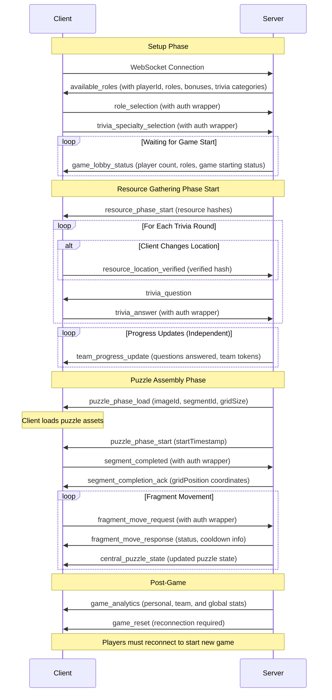

# Canvas Conundrum - WebSocket Communication Specification

## Connection Lifecycle

### Initial Connection
- Establish secure WebSocket connection
- Server generates unique player identifier
- Client authentication via generated UUID
- Game session initialization

## Authentication Format
All client-to-server events after initial connection use wrapper structure:
```json
{
  "auth": {
    "playerId": "uuid-generated-by-server"
  },
  "payload": {
    // Event-specific data
  }
}
```

## Game Phases and Events

### 1. Setup Phase

#### Client to Server Events
- `player_join`: 
  - Initial connection request (no auth wrapper needed)

#### Server to Client Events
- `available_roles`:
  ```json
  {
    "playerId": "uuid-generated-by-server",
    "roles": [
      {
        "role": "art_enthusiast",
        "resourceBonus": 1.5,
        "available": true
      },
      {
        "role": "detective", 
        "resourceBonus": 1.3,
        "available": false
      }
    ],
    "triviaCategories": ["tech", "art", "history", "science"]
  }
  ```

- `role_selection`:
  ```json
  {
    "auth": {
      "playerId": "uuid-generated-by-server"
    },
    "payload": {
      "role": "art_enthusiast"
    }
  }
  ```

- `trivia_specialty_selection`:
  ```json
  {
    "auth": {
      "playerId": "uuid-generated-by-server"
    },
    "payload": {
      "specialties": ["tech", "art"]
    }
  }
  ```

- `game_lobby_status`:
  ```json
  {
    "currentPlayers": 6,
    "playerRoles": {
      "art_enthusiast": 2,
      "detective": 1,
      "tourist": 2,
      "janitor": 1
    },
    "gameStarting": false,
    "waitingMessage": "Waiting for more players..."
  }
  ```

### 2. Resource Gathering Phase

#### Server to Client Events (Phase Start)
- `resource_phase_start`:
  ```json
  {
    "resourceHashes": {
      "anchor": "hash_anchor_station",
      "chronos": "hash_chronos_station", 
      "guide": "hash_guide_station",
      "clarity": "hash_clarity_station"
    }
  }
  ```

- `trivia_question`:
  ```json
  {
    "questionId": "q123",
    "text": "Question text",
    "category": "tech",
    "difficulty": "medium",
    "timeLimit": 60
  }
  ```

- `team_progress_update`:
  ```json
  {
    "questionsAnswered": 15,
    "totalQuestions": 40,
    "teamTokens": {
      "anchorTokens": 3,
      "chronosTokens": 2,
      "guideTokens": 1,
      "clarityTokens": 1
    }
  }
  ```

#### Client to Server Events
- `resource_location_verified`:
  ```json
  {
    "auth": {
      "playerId": "uuid-generated-by-server"
    },
    "payload": {
      "verifiedHash": "hash_anchor_station"
    }
  }
  ```
  
  **Note**: Clients only need to send this event when changing locations. If staying at the same location between rounds, no reverification is required.

- `trivia_answer`:
  ```json
  {
    "auth": {
      "playerId": "uuid-generated-by-server"
    },
    "payload": {
      "questionId": "q123",
      "answer": "selected_answer",
      "timestamp": 1234567890
    }
  }
  ```

### 3. Puzzle Assembly Phase

#### Server to Client Events (Phase Start)
- `puzzle_phase_load`:
  ```json
  {
    "imageId": "masterpiece_001",
    "segmentId": "segment_a5",
    "gridSize": 4
  }
  ```

- `puzzle_phase_start`:
  ```json
  {
    "startTimestamp": 1234567890
  }
  ```

#### Grid Configuration Management
- Dynamic grid sizing algorithm:
  ```
  Grid Size = Ceil(Sqrt(Total Players))
  Total Fragments = Grid Size²
  ```

#### Fragment Movement Protocol
- Movement Cooldown: 1 second
- Prevents race conditions
- Ignores rapid successive move requests

#### Client to Server Events
- `segment_completed`:
  ```json
  {
    "auth": {
      "playerId": "uuid-generated-by-server"
    },
    "payload": {
      "segmentId": "segment_a5",
      "completionTimestamp": 1234567890
    }
  }
  ```

- `fragment_move_request`:
  ```json
  {
    "auth": {
      "playerId": "uuid-generated-by-server"
    },
    "payload": {
      "fragmentId": "unique_identifier",
      "newPosition": {"x": 0, "y": 0},
      "timestamp": 1234567890
    }
  }
  ```

#### Server to Client Events
- `segment_completion_ack`:
  ```json
  {
    "status": "acknowledged",
    "segmentId": "segment_a5",
    "gridPosition": {"x": 2, "y": 3}
  }
  ```

- `fragment_move_response`:
  ```json
  {
    "status": "success" | "ignored" | "invalid",
    "reason": "cooldown" | "out_of_bounds" | null,
    "fragment": { /* fragment details */ },
    "nextMoveAvailable": 1234567890
  }
  ```

- `central_puzzle_state`:
  - Complete puzzle configuration
  - Fragment locations
  - Player progress

#### Disconnection Handling
- Immediate fragment auto-solve
- Random grid placement
- Broadcast disconnection to all players

### 4. Post-Game Events

#### Server to Client Events
- `game_analytics`:
  ```json
  {
    "personalAnalytics": {
      "playerId": "uuid-generated-by-server",
      "tokenCollection": { /* token stats */ },
      "triviaPerformance": { /* trivia stats */ },
      "puzzleSolvingMetrics": { /* puzzle stats */ }
    },
    "teamAnalytics": {
      "overallPerformance": { /* team stats */ },
      "collaborationScores": { /* team coordination */ },
      "resourceEfficiency": { /* resource allocation */ }
    },
    "globalLeaderboard": [
      {
        "playerId": "uuid",
        "playerName": "Player1", 
        "totalScore": 1250,
        "rank": 1
      }
    ]
  }
  ```

- `game_reset`:
  ```json
  {
    "message": "Game resetting. Please rejoin to start a new game.",
    "reconnectRequired": true
  }
  ```

## Error Handling and Edge Cases
- Robust error detection
- Graceful degradation
- Comprehensive logging
- Invalid authentication handling

## Performance Considerations
- Efficient data serialization
- Minimal payload size
- Rate limiting
- Connection state management

## Security Measures
- Secure WebSocket connection
- UUID-based authentication
- Input validation
- Anti-cheat mechanisms

## Technical Specifications
- Minimum Grid: 3x3 (1-9 players)
- Maximum Dynamic Grid Scaling
- Consistent 1-second movement cooldown
- Robust error handling
- Prevent race conditions

### Grid Size Progression
- 1-9 players: 3x3 (9 fragments)
- 10-16 players: 4x4 (16 fragments)  
- 17-25 players: 5x5 (25 fragments)
- Continues with n² grid sizes

### Disconnection Workflow
1. Detect WebSocket communication failure
2. Mark player as disconnected
3. Auto-solve player's fragment
4. Randomly place fragment
5. Notify all players
6. Continue game progression

## Technical Considerations
- WebSocket connection maintained throughout game
- Fallback to polling if WebSocket connection fails
- Secure authentication for each game session
- Encryption of sensitive game state information

## Performance Optimization
- Minimal payload size
- Efficient data serialization
- Rate limiting on event frequency
- Batch updates where possible

## Error Handling
- Graceful degradation of features
- Clear error messages
- Automatic reconnection attempts
- Fallback mechanisms for critical game events


